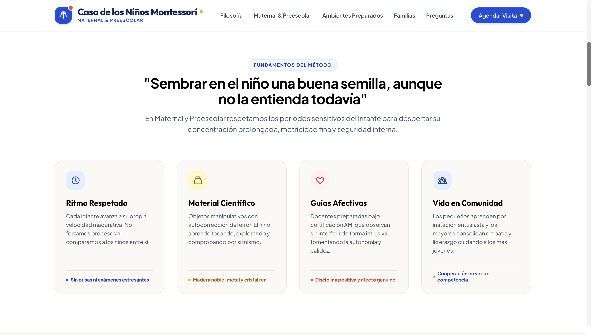
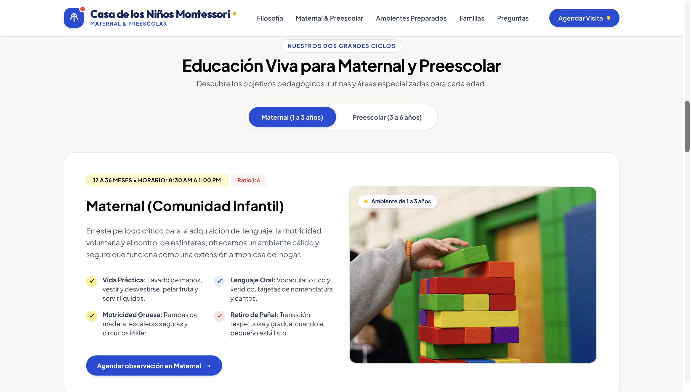
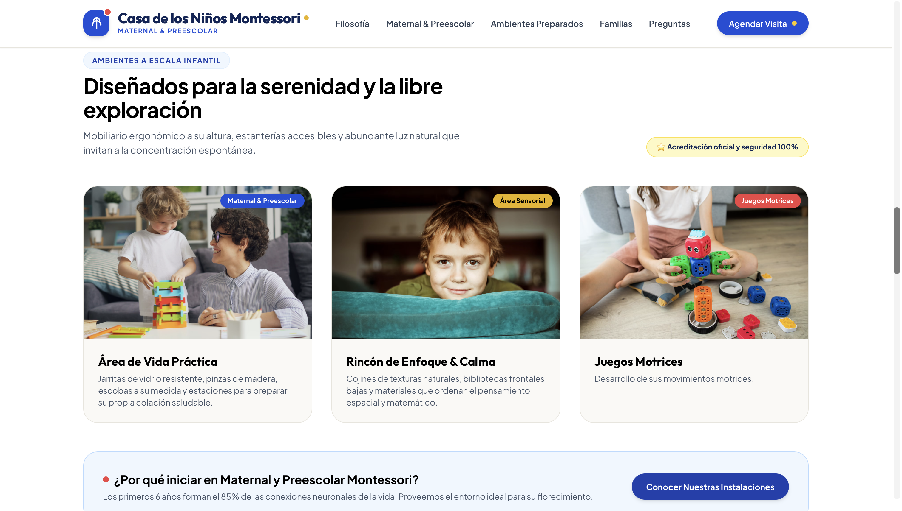
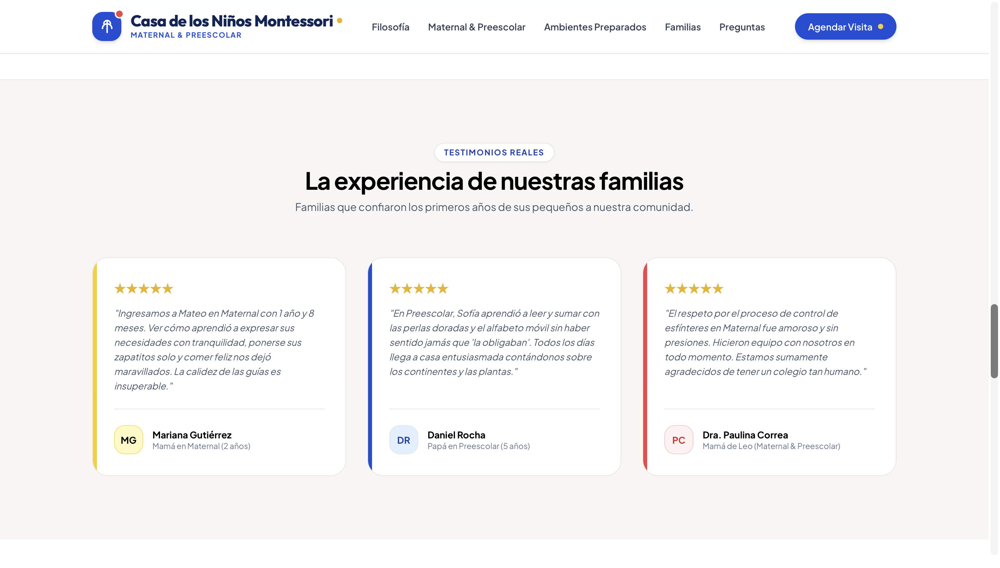
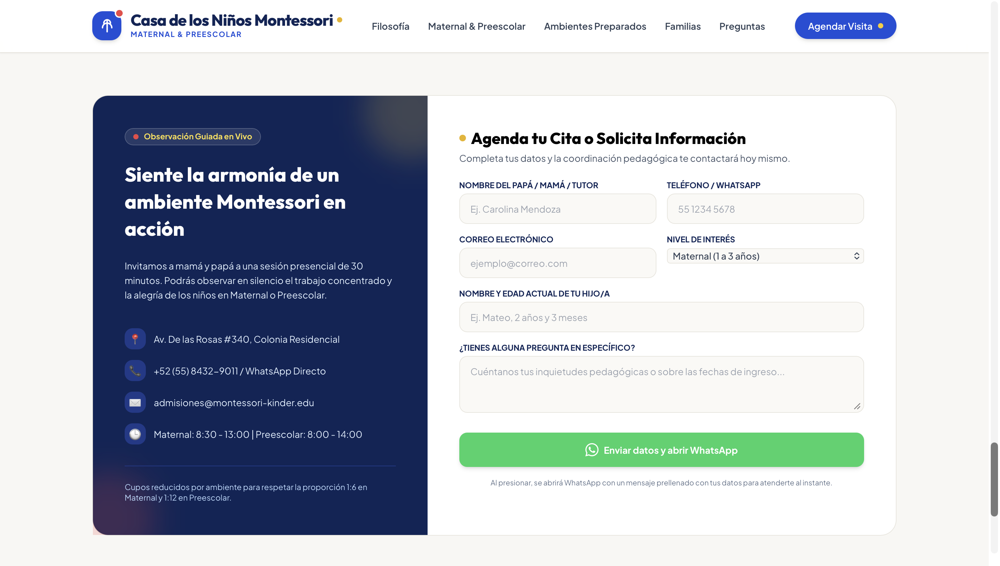

# 🌱 Colegio Montessori — Maternal y Preescolar


Landing page institucional para un **Colegio Montessori de nivel Maternal y Preescolar** (1 a 6 años), que comunica la filosofía del método, los dos ciclos educativos, los ambientes preparados, testimonios de familias y un formulario de admisiones conectado a WhatsApp.

> 🎨 **Nota:** Este proyecto es una **propuesta de diseño y un ejercicio de práctica**, desarrollado con fines de portafolio y demostración de maquetación/UX. El colegio, los testimonios, datos de contacto e información institucional son **ficticios** y no corresponden a la institución real en operación.

🔗 **Demo en vivo:** [https://giomerida.github.io/montessori/](https://giomerida.github.io/montessori/)

---

## 📋 Tabla de Contenidos

- [Sobre el proyecto](#-sobre-el-proyecto)
- [Capturas de pantalla](#-capturas-de-pantalla)
- [Tecnologías utilizadas](#-tecnologías-utilizadas)
- [Instalación y uso](#-instalación-y-uso)
- [Secciones del sitio](#-secciones-del-sitio)
- [Niveles educativos](#-niveles-educativos)
- [Ambientes preparados](#-ambientes-preparados)
- [Preguntas frecuentes](#-preguntas-frecuentes)
- [Formulario de admisiones](#-formulario-de-admisiones)
- [Estructura del proyecto](#-estructura-del-proyecto)
- [Roadmap](#-roadmap)
- [Autor](#-autor)

---

## 📌 Sobre el proyecto

Esta landing page fue diseñada como **ejercicio de práctica y propuesta visual** para representar la identidad de un colegio con enfoque en el **método Montessori**, un modelo pedagógico centrado en el respeto al ritmo individual del niño, el material sensorial autocorrectivo y los ambientes preparados a escala infantil.

El proyecto pone en práctica:

- Narrativa de marca educativa con tono cálido y emocional.
- Presentación de dos ciclos (Maternal y Preescolar) con pestañas interactivas.
- Diseño de tarjetas informativas con íconos y micro-contenido.
- Sección de testimonios con calificación por estrellas.
- Acordeón de preguntas frecuentes.
- Formulario de contacto con **generación de mensaje prellenado hacia WhatsApp**.

**Cifras destacadas en el sitio (ilustrativas):**

| Indicador                                             | Valor |
| ----------------------------------------------------- | ----- |
| Ratio Maternal                                        | 1:6   |
| Material sensorial                                    | 100%  |
| Años de experiencia (guías)                           | +15   |
| Conexiones neuronales formadas en los primeros 6 años | 85%   |

---

## 📸 Capturas de pantalla

### 🏠 Hero — Portada


### 🧩 Fundamentos del método



### 👶 Niveles — Maternal y Preescolar



### 🏡 Ambientes preparados



### 💬 Testimonios



### 📝 Formulario de admisiones



---

## 🛠️ Tecnologías utilizadas

| Tecnología               | Uso                                                                                               |
| ------------------------ | ------------------------------------------------------------------------------------------------- |
| **HTML5**                | Estructura semántica del sitio                                                                    |
| **CSS3**                 | Estilos, animaciones y diseño responsivo                                                          |
| **JavaScript (Vanilla)** | Pestañas interactivas (Maternal/Preescolar), acordeón de FAQ y generación del mensaje de WhatsApp |
| **Unsplash CDN**         | Imágenes ilustrativas de ambientes y material Montessori                                          |
| **GitHub Pages**         | Hosting y despliegue continuo                                                                     |

---

## 🚀 Instalación y uso

Este proyecto no requiere instalación de dependencias ni backend. Solo clona el repositorio y abre el archivo principal.

### Clonar el repositorio

```bash
git clone https://github.com/giomerida/montessori.git
cd montessori
```

### Ejecutar localmente

```bash
# Con Python 3
python -m http.server 8080

# Con Node.js
npx serve .
```

Visita `http://localhost:8080` en tu navegador.

### Despliegue en GitHub Pages

El sitio está listo para desplegarse directamente en GitHub Pages activando esta opción en la configuración del repositorio.

---

## 🧩 Secciones del sitio

| Sección                   | Ancla        | Descripción                                                                                      |
| ------------------------- | ------------ | ------------------------------------------------------------------------------------------------ |
| **Inicio**                | —            | Hero con propuesta de valor, indicadores clave y CTAs hacia agenda de visita                     |
| **Filosofía**             | `#filosofia` | Fundamentos del método: ritmo respetado, material científico, guías afectivas, vida en comunidad |
| **Maternal & Preescolar** | `#programas` | Pestañas con los dos ciclos educativos, objetivos pedagógicos y rutinas por edad                 |
| **Ambientes Preparados**  | `#ambientes` | Galería de espacios: Vida Práctica, Rincón de Enfoque, Huerto & Juegos Motrices                  |
| **Familias**              | `#comunidad` | Testimonios reales (simulados) de familias con calificación por estrellas                        |
| **Preguntas Frecuentes**  | `#preguntas` | Acordeón con dudas comunes sobre ingreso, adaptación, horarios e idiomas                         |
| **Agendar Visita**        | `#visita`    | Formulario de admisiones + datos de contacto + WhatsApp directo                                  |
| **Footer**                | —            | Enlaces rápidos, niveles, admisiones y aviso de privacidad                                       |

---

## 👶 Niveles educativos

### Maternal (Comunidad Infantil) — 12 a 36 meses

**Horario:** 8:30 AM – 1:00 PM · **Ratio:** 1:6

- ✓ **Vida Práctica:** lavado de manos, vestirse y desvestirse, pelar fruta, servir líquidos.
- ✓ **Lenguaje Oral:** vocabulario rico, tarjetas de nomenclatura y cantos.
- ✓ **Motricidad Gruesa:** rampas de madera, escaleras seguras, circuitos Pikler.
- ✓ **Retiro de pañal:** transición respetuosa y gradual.

### Preescolar (Casa de los Niños) — 3 a 6 años

**Horario:** 8:00 AM – 2:00 PM · **Certificación:** SEP

- ✓ **Área Sensorial:** Torre Rosa, Escalera Marrón, cilindros con perillas graduadas.
- ✓ **Matemáticas Concretas:** sistema decimal y operaciones con perlas doradas.
- ✓ **Lectoescritura:** letras de lija táctiles y alfabeto móvil tridimensional.
- ✓ **Educación Cósmica:** botánica, geografía de continentes, música y paz.

---

## 🏡 Ambientes preparados

| Ambiente                      | Descripción                                                                                  |
| ----------------------------- | -------------------------------------------------------------------------------------------- |
| **Área de Vida Práctica**     | Jarritas de vidrio resistente, pinzas de madera, escobas a su medida y estación de colación  |
| **Rincón de Enfoque & Calma** | Cojines de texturas naturales, bibliotecas frontales bajas, material de pensamiento espacial |
| **Huerto & Juegos Motrices**  | Siembra orgánica, composta, agua y trepadoras de madera para fuerza, equilibrio y ecología   |

---

## ❓ Preguntas frecuentes

1. **¿A partir de qué edad pueden ingresar a Maternal y qué requisitos hay?**
2. **¿Cómo se adapta un niño egresado de Preescolar Montessori a una primaria tradicional?**
3. **¿Tienen horario extendido y servicio de comedor?**
4. **¿Cómo se imparten los idiomas en Preescolar?**

> Implementado como acordeón expandible (`+` / `-`) para mantener la página limpia y escaneable.

---

## 📝 Formulario de admisiones

El formulario captura los siguientes campos y genera un mensaje prellenado que **abre WhatsApp directamente**, sin necesidad de backend:

- Nombre del papá / mamá / tutor
- Teléfono / WhatsApp
- Correo electrónico
- Nivel de interés (select): Maternal, Preescolar, Ambos niveles / Horario Extendido
- Nombre y edad actual del hijo/a
- Pregunta específica _(opcional)_

**Datos de contacto (ilustrativos):**

- 📍 Av. de las Rosas #340, Colonia Residencial
- 📞 +52 (55) 8432-9011 / WhatsApp directo
- ✉️ admisiones@montessori-kinder.edu
- 🕒 Maternal: 8:30–13:00 · Preescolar: 8:00–14:00

---

## 📁 Estructura del proyecto

```
montessori/
├── index.html          # Página principal del sitio
├── css/                  # (Sugerido) Hojas de estilo
├── js/                    # (Sugerido) Lógica de tabs, acordeón y WhatsApp
└── README.md             # Este archivo
```

> Las imágenes de ambientes y material Montessori se cargan dinámicamente desde **Unsplash CDN** como recursos ilustrativos para esta propuesta de diseño.

---

## 🗺️ Roadmap

- [ ] Agregar galería de fotos propias (reemplazar imágenes de Unsplash)
- [ ] Sección de costos, colegiaturas y becas (como propuesta de contenido)
- [ ] Calendario de fechas de observación guiada disponibles
- [ ] Mapa interactivo de ubicación
- [ ] Modo oscuro
- [ ] Versión multilenguaje (ES / EN) dado el enfoque bilingüe del preescolar

---

## 👨‍💻 Autor

Desarrollado por **Giodev**

- 🌐 Sitio web: [giomerida.dev](https://giomerida.dev)
- 🐙 GitHub: [@giomerida](https://github.com/giomerida)

---

<div align="center">

© 2026 **Colegio Montessori Maternal & Preescolar** — Propuesta de diseño y proyecto de práctica realizado por **GioDev**.

</div>
